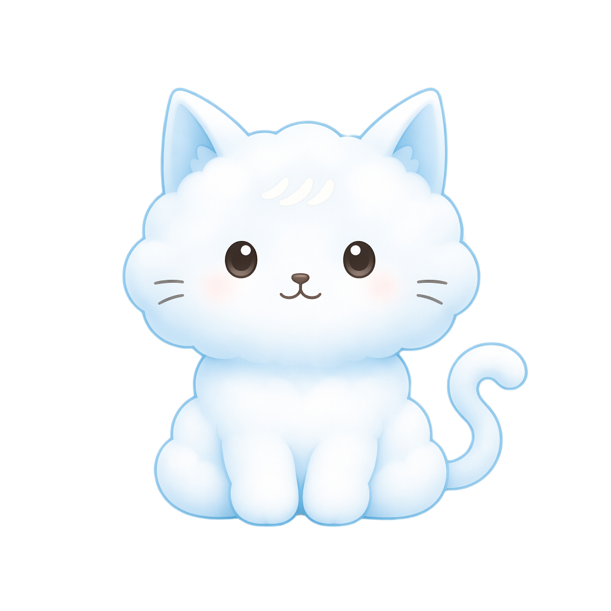

<div align="center">
  

  <h1>🌤️ Cinna Design</h1>

  <p>
    <strong>Cloud-soft dessert themed React UI components.</strong><br />
    A gentle component library for warm, readable, application-ready interfaces.
  </p>

  <p>
    <a href="./README_zh_CN.md">简体中文</a>
    ·
    <a href="https://icelemon233.github.io/cinna-design/">Docs</a>
    ·
    <a href="https://github.com/icelemon233/cinna-design/releases/tag/v0.1.0">Release v0.1.0</a>
  </p>

  <p>
    <a href="https://github.com/icelemon233/cinna-design/releases/tag/v0.1.0"></a>
    <a href="./LICENSE"></a>
    
    
    
    
    <a href="https://icelemon233.github.io/cinna-design/"></a>
  </p>
</div>

---

## ✨ Why Cinna Design?

Cinna Design provides a cloud-and-dessert themed set of React UI components and design primitives. It aims to make interface building concise, consistent, and readable: buttons, forms, cards, data displays, feedback, and overlays can be embedded into product pages while keeping a warm visual identity across docs, demos, and apps.

The library is currently at the `v0.1.0` prototype stage, with polished core components, design tokens, original icons, a documentation site, and 70+ lightweight UI prototypes. It is a starting point for design systems, themed component experiments, and future application-grade component coverage.

## 📦 Installation

`@cinna-design/react` is the intended public consumer package. After the package is published, install it with:

```bash
pnpm add @cinna-design/react
```

Import styles once in your application:

```ts
import '@cinna-design/react/style.css';
```

## ⚡ Quick Usage

```tsx
import '@cinna-design/react/style.css';
import { Button, Card, CinnaLoading, Input } from '@cinna-design/react';

export function DessertPanel() {
  return (
    <Card title="Cloud order" tone="blue">
      <Input label="Dessert name" placeholder="Milk cloud cake" />
      <Button style={{ marginTop: 16 }}>Save recipe</Button>
      <CinnaLoading label="Whisking clouds" />
    </Card>
  );
}
```

## 🧁 What's Included?

### ☁️ Polished Core

- 🔘 `Button` - soft pressable actions with variants, sizes, icons, shapes, and loading state.
- 🍰 `Card` - cream, blue, butter, strawberry, pistachio, and lavender content surfaces.
- 🧾 `Input` - labeled input with helper text, error state, prefix, and suffix.
- ☁️ `CinnaLoading` - signature cloud loading motion with reduced-motion support.
- 🎛️ `ConfigProvider` - scoped CSS variable overrides for local theme tuning.

### 🧩 Broader Component Coverage

Cinna Design also exposes lightweight prototypes for common UI needs:

- 🧱 Layout: `Space`, `Flex`, `Row`, `Col`, `Layout`
- 🧭 Navigation: `Breadcrumb`, `Menu`, `Tabs`, `Steps`, `Pagination`, `Anchor`
- ✍️ Data entry: `Select`, `Checkbox`, `Radio`, `Switch`, `Slider`, `Rate`, `DatePicker`, `Upload`, `Form`
- 📊 Data display: `Avatar`, `Badge`, `Tag`, `Table`, `List`, `Timeline`, `Statistic`, `Tree`
- 💬 Feedback and overlays: `Alert`, `Message`, `Notification`, `Progress`, `Skeleton`, `Modal`, `Drawer`, `Tooltip`, `Popover`

## 🎨 Design Language

Cinna Design's first visual direction is built around:

- 🌤️ milk-cloud blue as the primary interaction color
- 🍦 cream and vanilla surfaces for warmth
- 🍫 cocoa text for readable contrast
- 🍓 butter, strawberry, pistachio, and lavender accents
- 🫧 rounded touch targets and gentle handmade motion

The goal is not to make every interface decorative. Sweetness should be the accent; clarity should remain the foundation.

## 📚 Documentation

The documentation site is prepared for GitHub Pages:

```text
https://icelemon233.github.io/cinna-design/
```

Build it locally with:

```bash
pnpm build:pages
```

## 🛠️ Local Preview

```bash
pnpm install
pnpm test
pnpm typecheck
pnpm build
pnpm dev
```

## 🚧 Project Status

`v0.1.0` is the first public source release. The package API, visual language, and component coverage are expected to keep evolving while the design system takes shape.

## 🪄 Originality

All content in this repository is independently designed or implemented with AI assistance, including the visual direction, components, documentation copy, and image assets. Cinna Design is not affiliated with, derived from, or intended to reproduce any third-party IP.

## 📄 License

MIT License. See [LICENSE](./LICENSE).
